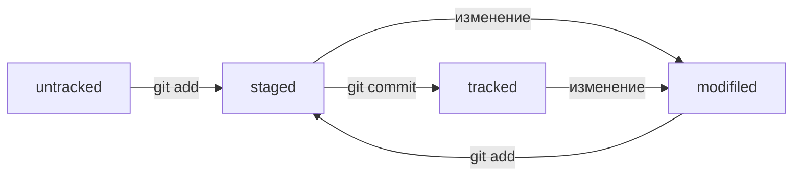

# Шпаргалка. Базовые команды в консоли  
  
## Навигация  
  
- `pwd` (от англ. *print working directory*, «показать рабочую папку») — покажи, в какой я папке;  
- `ls` (от англ. *list directory contents*, «отобразить содержимое директории») — покажи файлы и папки в текущей папке;  
- `ls -a` — покажи также скрытые файлы и папки, названия которых начинаются с символа .;  
- `cd first-project` (от англ. *change directory*, «сменить директорию») — перейди в папку `first-project`;  
- `cd first-project/html` — перейди в папку `html`, которая находится в папке `first-project`;  
- `cd ..` — перейди на уровень выше, в родительскую папку;  
- `cd ~` — перейди в домашнюю директорию (`/Users/Username`);  
- `cd /` — перейди в корневую директорию.  

## Работа с файлами и папками  
  
### Создание  
- `touch index.html` (англ. *touch*, «коснуться») — создай файл `index.html` в текущей папке;  
- `touch index.html style.css script.js` — если нужно создать сразу несколько файлов, можно напечатать их имена в одну строку через пробел;  
- `mkdir second-project` (от англ. *make directory*, «создать директорию») — создай папку с именем `second-project` в текущей папке.  
  
### Копирование и перемещение  
- `cp file.txt ~/my-dir` (от англ. *copy*, «копировать») — скопируй файл в другое место;  
- `mv file.txt ~/my-dir` (от англ. *move*, «переместить») — перемести файл или папку в другое место.  
  
### Чтение  
- `cat file.txt` (от англ. *concatenate and print*, «объединить и распечатать») — распечатай содержимое текстового файла `file.txt`.  
  
### Удаление  
- `rm about.html` (от англ. *remove*, «удалить») — удали файл `about.html`;  
- `rmdir images` (от англ. *remove directory*, «удалить директорию») — удали папку `images`;  
- `rm -r second-project` (от англ. *remove*, «удалить» + *recursive*, «рекурсивный») — удали папку `second-project` и всё, что она содержит.  
  
## Полезные возможности  
- Команды необязательно печатать и выполнять по очереди. Можно указать их списком — разделить двумя амперсандами (`&&`).  
- У консоли есть собственная память — буфер с несколькими последними командами. По ним можно перемещаться с помощью клавиш со стрелками вверх (`↑`) и вниз (`↓`).  
- Чтобы не вводить название файла или папки полностью, можно набрать первые символы имени и дважды нажать `Tab`. Если файл или папка есть в текущей директории, командная строка допишет путь сама.  
- Например, вы находитесь в папке `dev`. Начните вводить `cd first` и дважды нажмите `Tab`. Если папка `first-project` есть внутри `dev`, командная строка автоматически подставит её имя. Останется только нажать `Enter`.  
  
## Хеш — основной идентификатор коммита  
- Git преобразует информацию о коммитах с помощью алгоритма SHA-1 и для каждого из них рассчитывает уникальный идентификатор — хеш.  
- Хеш — основной идентификатор коммита и позволяет узнать его автора, дату и содержимое закоммиченных файлов.  
- Все хеши, а также таблицу соответствий `хеш → информация о коммите` Git хранит в папке `.git`.  

## Исследуем лог коммита  
- Элементы описания коммита - `git log`.  
- Можно вызвать не только полный лог, но и сокращённый — это делается командой `git log --oneline`.  
- В сокращённом логе выводятся сокращённые хеши — их можно использовать точно так же, как и полные.  
  
## HEAD — всему голова  
- В числе прочих файлов в папке `.git` есть служебный файл `HEAD`. Он указывает на самый свежий коммит.  
- Вместо хеша последнего коммита можно написать слово `HEAD` — Git вас поймёт.  
- Внутри `HEAD` — ссылка на служебный файл: `refs/heads/master` (или `refs/heads/main` в зависимости от названия ветки). Там находится хеш последнего коммита.  

## Статусы файлов в Git  
- `untracked/tracked` (англ. «*неотслеживаемый*»/«*отслеживаемый*») - Статусом `untracked` помечается файл, о существовании которого Git знает, но не следит за изменениями в нём. Этот статус — противоположность `tracked`, в который попадают все файлы, отслеживаемые Git.  
- `staged` (англ. «*подготовленный*»)- Файл переходит в статус `staged` после выполнения `git add`.  
- `modified` (англ. «*изменённый*»)- Статус `modified` означает, что файл был изменён.  
  
####  **Для файлов в состояниях `staged` и `modified` обычно не указывают, что они также `tracked`, потому что это состояние подразумевается.**  
  
### Типичный жизненный цикл файла в Git  
- Большинство файлов в проектах «шагает» по следующему циклу: «изменён» → «добавлен в список на коммит» → «закоммичен» → «изменён» → и так далее.  
- Схема изменения статусов коммита:  

  
## Как исправить коммит  
- Флаг `--amend` рассчитан на работу с последним коммитом (`HEAD`).  
- Дополнить коммит новыми файлами можно с помощью `git commit --amend --no-edit`. Благодаря опции `--no-edit` сообщение к коммиту останется таким, каким и было.  
- Изменить сообщение к коммиту позволяет команда `git commit --amend -m "Обновлённое сообщение коммита"`. 
  
#### **Вот как выйти из Vim: Нажмите клавишу `Esc`.Наберите последовательность символов `:qa!`. Нажмите `Enter`.**  
  
## Как откатиться назад, если «всё сломалось»  
- **Выполнить unstage изменений:** Команда `git restore --staged <file>` переведёт файл из `staged` обратно в `modified` или `untracked`.  
- **«Откатить» коммит:** Команда `git reset --hard <commit hash>` «*откатит*» историю до коммита с хешем <`hash`>. Более поздние коммиты потеряются!  
- **«Откатить» изменения, которые не попали ни в `staging`, ни в *коммит*:** Команда `git restore <file>` «*откатит*» изменения в файле до последней сохранённой (в *коммите* или в `staging`) версии.  

## Просмотр изменения в файлах  
- Команда `git diff` сравнит последнюю закоммиченную версию файла с той, что находится в состоянии `modified`.  
- Команда `git diff --staged` покажет изменения в `staged`-файлах относительно последних закоммиченных версий. 
- Команда `git diff <коммит1> <коммит2>` сравнивает изменения в двух коммитах.  
  
## Игнорирование файлов в Git  
- Если нужно, чтобы Git игнорировал какие-то файлы, стоит составить файл `.gitignore`.  
- Посмотреть, что игнорируется, можно с помощью команды `git status --ignored`.  
- Сам файл `.gitignore` — это обычный файл в репозитории. Его тоже стоит закоммитить.  
- Шаблонов много, но их легко найти в интернете вместе с примерами использования.  
  
## Клонировать репозиторий — `git clone`  
- Команда `git clone` копирует проект на локальный компьютер.  
- Так же `git clone` автоматически связывает локальный репозиторий с удалённым.  
  
## Что такое ветка  
- *Ветка* — это последовательность независимых изменений.  
- Благодаря веткам несколько человек могут работать над одним репозиторием и не мешать друг другу. А ещё ветки помогают декомпозировать большую и страшную задачу на маленькие и понятные.  
- Основная версия проекта хранится в главной ветке `main` (или `master`).  
  
№№ Как создать *ветку*  
- С помощью команды `git branch` можно посмотреть, какие в проекте есть ветки и в какой из них вы сейчас находитесь.  
- Команда `git branch <название_ветки>` - позволяет создать новую *ветку*. 
  
## Как шагать с *ветки* на *ветку*  
- Команда `git checkout <название_ветки>` позволяет переключаться на другую ветку.  
- Разные ветки в одном проекте существуют независимо. Изменения в одной не влияют на изменения в другой.  
- В *Git* можно создать ветку и сразу же перейти в неё командой `git checkout -b <название_ветки>`.  
- Ветка указывает на коммит, который сделан в ней последним. При этом две ветки могут ссылаться на один и тот же коммит — например, если вы только что создали ветку, но ещё не успели внести в неё коммит.  
  
## Как сравнивать *ветки"  
- Команда `git diff` может сравнивать ветки по их названиям.  
(Например, команда `git diff main feature/my-feature` выведет разницу между основной веткой и веткой `feature/my-feature`.)  
- Git поддерживает суффикс навигации `~`. С его помощью можно сослаться на предыдущие коммиты.  
(Например, если вы находитесь в ветке `main` и хотите вывести разницу между тем коммитом, который был три коммита назад, и текущим, нужно выполнить `git diff main~3 main`.)  
  
## Объединение и удаление *ветки*  
- Выполнить слияние веток позволяет команда `git merge <название_ветки>`. В качестве параметра указывают название ветки, которую нужно влить в текущую.  
- Удалять ненужные ветки после слияния — хорошая практика. За удаление веток отвечает команда `git branch -D <название_ветки>` и её щадящий вариант с флагом `-d`.  
  
 
## Создаём `pull request`  
- *Пул-реквест* — это запрос на рассмотрение предлагаемых изменений и часть процесса ревью.  
- Запрос на изменения можно инициировать двумя способами: через ссылку, которую *Git* выводит после создания ветки, или через интерфейс *GitHub*.  
- После создания *пул-реквеста* ваши коллеги сделают *ревью* — оценят предложенные вами правки и оставят свои комментарии.  
- По результатам ревью ваши правки могут быть приняты в основную ветку проекта или возвращены на доработку.  
  
## Забирать изменения из удалённого репозитория  
- Команда `git pull` позволяет подтянуть изменения из удалённого репозитория в локальный.  
- Перед созданием нового *пул-реквеста* считается хорошей практикой перейти в главную ветку, «подтянуть» в неё изменения, а затем добавить эти изменения в вашу ветку с помощью `git merge main`.  
  
## Состояние fast-forward  
- Если истории двух веток не «разошлись» и их коммиты выстраиваются в одну цепочку, эти ветки можно объединить в режиме *fast-forward*.  
- Режим *fast-forward* можно отключить с помощью флага `--no-ff`. Например: `git merge --no-ff add-docs`  
- Также *fast-forward* можно отключить «навсегда» (до тех пор, пока вы не вернёте настройку «как было») с помощью настройки `merge.ff`. Например `git config [--global] merge.ff false`.  
  
## Состояние Non-fast-forward  
- Если истории двух веток всё же «разошлись», при слиянии веток Git создаст коммит слияния.  
- При объединении веток в состоянии не-fast-forward возможны (но не обязательны) конфликты. Если конфликты всё же возникли, Git попытается разрешить их самостоятельно или попросит вас сделать это вручную.  
  
### Чаще всего сообщения к коммитам слияния не редактируют и оставляют «как предложил Git». Для таких случаев удобен флаг `--no-edit`. Например `git merge --no-edit %another_branch%`.  
  
## Если `git push` - *не-fast-forward*  
### Пара слов о `rebase`  
- В Git можно решить проблему «разошедшихся» веток с помощью операции `rebase` (англ. «перебазирование»). Эта операция позволяет изменить точку (коммит), от которой отделилась ветка.
- Могут возникать конфликты между изменениями, как при слиянии веток;  
- Если действовать неаккуратно, можно «сломать» репозиторий.  
### Пара слов о `git push --force`  
- Команда `git push --force` — это форсированный пуш. Чтобы его выполнить, используют флаг `--force` (англ. «сила», «заставить»).  
- В очень редких случаях это уместная команда. Например, если кто-то нечаянно «сломал» ветку *main@origin*, можно найти копию репозитория, в которой ветка *main* не «сломана», и использовать `git push --force` для восстановления ветки в origin.

## Модели веток. Простая feature branch модель  
- Разные компании и команды используют разные модели работы с Git. Эти модели описывают структуру веток в проекте, а также правила создания и слияния коммитов в них.  
- Один из самых простых и популярных подходов — feature branch workflow. Он предполагает, что работа над функциональностью ведётся в отдельной feature-ветке. Когда всё готово, эта ветка вливается в основную.  
- Подход **feature branch workflow** — лишь шаблон, по которому можно действовать. Многие компании и команды меняют его под свои нужды, но неизменно одно: хочешь сделать новую функциональность или исправить баг — создай новую ветку!  
  
### Наиболее популярные модели веток:  
- **Feature branch workflow** — простой и самый популярный вариант. Если коротко, в нём для каждого нового изменения создаётся новая ветка, которая позже вливается в *main* с помощью `git merge`.  
- **Git flow** — более сложный вариант. Подход похож на *feature branch workflow*, но в нём создаётся больше веток, а изменения (коммиты) делят на разные типы: исправление, новая функциональность и так далее. Разные типы коммитов попадают в разные ветки.  
- **Trunk-based** — популярный в больших компаниях (таких как Яндекс, Google и прочих) подход, который обещает бо́льшую скорость работы в крупных командах.  
(Этот подход тоже похож на *feature branch workflow*. Главное отличие в том, что участники проекта вливают (`merge`) свой код в основную ветку максимально часто. Например, каждый день.)  

## Pull request и code review  
- Во многих командах пул-реквест — это основной путь, по которому изменения или исправления попадают в основную ветку проекта.  
- Важный этап пул-реквеста — ревью. В ходе ревью коллега оценит правки и предложит доработки, если они нужны. Когда всё будет готово, ревьюер примет («апрувнет») изменения, затем их можно будет интегрировать в main.  
  

  

